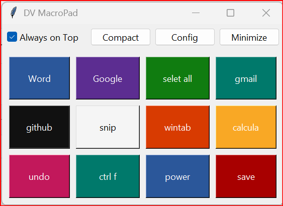
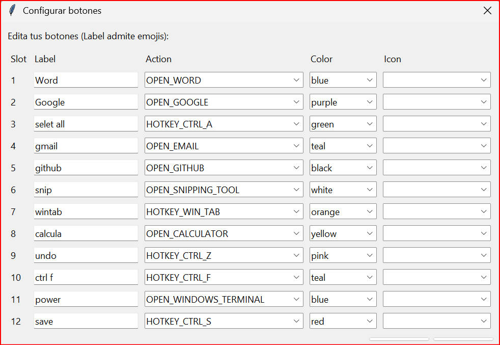

# DV MacroPad 4x3
## Application Preview

### Main Interface


### Button Configuration



---

# English

## Description

DV MacroPad 4x3 is a lightweight desktop macro pad application for Windows built with Python.
It simulates a programmable 4×3 macro keypad that allows users to trigger shortcuts, commands, or custom workflows.

This project was created as part of my personal learning journey in software development and cybersecurity tools, and it is included in my GitHub portfolio.

---

## Features

• 4×3 configurable macro grid (12 programmable buttons)
• Simple and clean desktop interface
• Button customization:

* Label
* Action
* Color
* Optional icon

• Configuration stored externally using JSON
• Compact Mode
• Always-on-Top option
• Portable executable support

---

## Project Structure

```
dv_macropad_4x3
│
├── app.py
├── requirements.txt
│
├── config
│   └── buttons.json
│
├── core
│
├── ui
│
├── assets
│   └── icons
│
└── build
    └── build_exe.py
```

---

## How It Works

Each macro button is defined inside the configuration file:

```
config/buttons.json
```

From this file you can configure:

* Button label
* Button color
* Action type
* Optional icon

This allows the MacroPad to be customized without modifying the main code.

---

## Running the Project (Development Mode)

Create a virtual environment:

```
python -m venv .venv
```

Activate the environment (Windows):

```
.venv\Scripts\activate
```

Install dependencies:

```
pip install -r requirements.txt
```

Run the application:

```
python app.py
```

---

## Building the Portable EXE

To create a standalone executable:

```
python build/build_exe.py
```

The compiled application will appear in:

```
dist/DV_MacroPad.exe
```

---

## Example Use Cases

• Quick keyboard shortcuts
• Automation macros
• Productivity workflows
• Developer utilities
• Stream-deck style desktop control

---

## Technologies Used

Python
Tkinter
JSON
PyInstaller

---

# Español

## Descripción

DV MacroPad 4x3 es una aplicación de escritorio para Windows desarrollada en Python que simula un **macro pad programable de 4×3 botones**.

Permite ejecutar accesos rápidos del teclado, comandos o flujos de trabajo personalizados desde una interfaz simple.

Este proyecto fue creado como parte de mi proceso de aprendizaje en **desarrollo de software y herramientas de ciberseguridad**, y forma parte de mi portafolio en GitHub.

---

## Características

• Cuadrícula de macros configurable de **4×3 (12 botones)**
• Interfaz simple y limpia
• Personalización de botones:

* Texto del botón
* Acción
* Color
* Icono opcional

• Configuración externa mediante archivo JSON
• Modo compacto
• Opción **Always on Top**
• Compatible con versión portable (.exe)

---

## Cómo Funciona

Cada botón del MacroPad se configura dentro del archivo:

```
config/buttons.json
```

Desde ese archivo puedes modificar:

* Texto del botón
* Color
* Tipo de acción
* Icono opcional

Esto permite personalizar completamente el MacroPad sin modificar el código principal.

---

## Ejecución del Proyecto

Crear entorno virtual:

```
python -m venv .venv
```

Activar entorno:

```
.venv\Scripts\activate
```

Instalar dependencias:

```
pip install -r requirements.txt
```

Ejecutar aplicación:

```
python app.py
```

---

## Compilar el Ejecutable

Para generar el archivo ejecutable:

```
python build/build_exe.py
```

El ejecutable aparecerá en:

```
dist/DV_MacroPad.exe
```

---

## Autor

Daniel Vega

GitHub:
https://github.com/dannyvega0781

---


